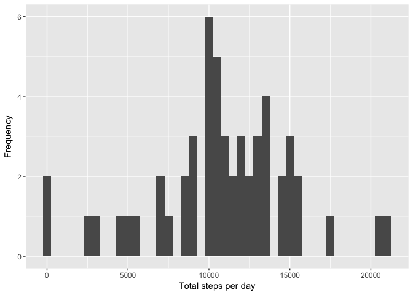
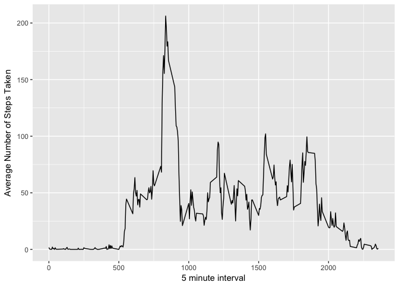
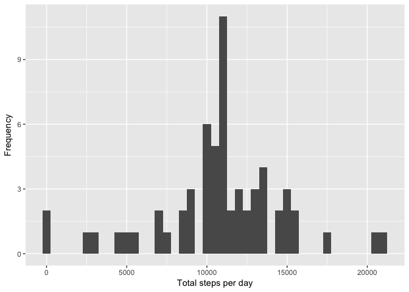
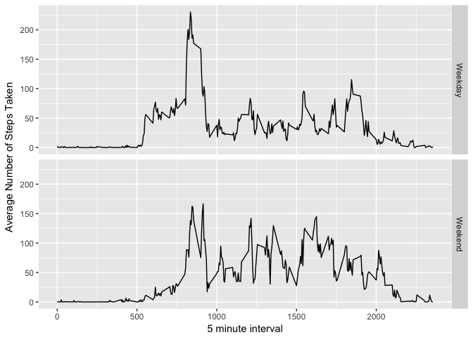

# Peer-graded Assignment: Course Project 1
## Loading and preprocessing the data

Show any code that is needed to

1. Load the data (i.e. 𝚛𝚎𝚊𝚍.𝚌𝚜𝚟())

```r
activity <- read.csv("activity.csv")
```

2. Process/transform the data (if necessary) into a format suitable for your analysis

```r
summary(activity)
```

```
##      steps                date          interval     
##  Min.   :  0.00   2012-10-01:  288   Min.   :   0.0  
##  1st Qu.:  0.00   2012-10-02:  288   1st Qu.: 588.8  
##  Median :  0.00   2012-10-03:  288   Median :1177.5  
##  Mean   : 37.38   2012-10-04:  288   Mean   :1177.5  
##  3rd Qu.: 12.00   2012-10-05:  288   3rd Qu.:1766.2  
##  Max.   :806.00   2012-10-06:  288   Max.   :2355.0  
##  NA's   :2304     (Other)   :15840
```

## What is mean total number of steps taken per day?

For this part of the assignment, you can ignore the missing values in the dataset.

1. Calculate the total number of steps taken per day

```r
library(dplyr)
```

```
## 
## Attaching package: 'dplyr'
```

```
## The following objects are masked from 'package:stats':
## 
##     filter, lag
```

```
## The following objects are masked from 'package:base':
## 
##     intersect, setdiff, setequal, union
```

```r
compActivity <- na.omit(activity)
compActivityByDay <- group_by(compActivity, date)
compActivityByDay <- summarize(compActivityByDay, steps=sum(steps))
head(compActivityByDay)
```

```
## # A tibble: 6 × 2
##         date steps
##       <fctr> <int>
## 1 2012-10-02   126
## 2 2012-10-03 11352
## 3 2012-10-04 12116
## 4 2012-10-05 13294
## 5 2012-10-06 15420
## 6 2012-10-07 11015
```

2. If you do not understand the difference between a histogram and a barplot, research the difference between them. Make a histogram of the total number of steps taken each day

```r
library(ggplot2)
qplot(steps, data=compActivityByDay, xlab='Total steps per day', ylab='Frequency', binwidth=500)
```

<!-- -->

3. Calculate and report the mean and median of the total number of steps taken per day

```r
mean(compActivityByDay$steps)
```

```
## [1] 10766.19
```

```r
median(compActivityByDay$steps)
```

```
## [1] 10765
```

## What is the average daily activity pattern?

1. Make a time series plot (i.e. 𝚝𝚢𝚙𝚎 = "𝚕") of the 5-minute interval (x-axis) and the average number of steps taken, averaged across all days (y-axis)

```r
activtyInt <- group_by(compActivity, interval)
activtyInt <- summarize(activtyInt, steps=mean(steps))
ggplot(activtyInt, aes(interval, steps)) + geom_line() + xlab("5 minute interval") +
    ylab("Average Number of Steps Taken")
```

<!-- -->

2. Which 5-minute interval, on average across all the days in the dataset, contains the maximum number of steps?

```r
activtyInt[activtyInt$steps==max(activtyInt$steps),]
```

```
## # A tibble: 1 × 2
##   interval    steps
##      <int>    <dbl>
## 1      835 206.1698
```

## Imputing missing values

Note that there are a number of days/intervals where there are missing values (coded as 𝙽𝙰). The presence of missing days may introduce bias into some calculations or summaries of the data.

1. Calculate and report the total number of missing values in the dataset (i.e. the total number of rows with 𝙽𝙰s)


```r
length(which(is.na(activity$steps)))
```

```
## [1] 2304
```
2. Devise a strategy for filling in all of the missing values in the dataset. The strategy does not need to be sophisticated. For example, you could use the mean/median for that day, or the mean for that 5-minute interval, etc.


```r
names(activtyInt)[2] <- "mean.steps"
imputeActivity <- merge(activity, activtyInt)
```

3. Create a new dataset that is equal to the original dataset but with the missing data filled in.

```r
imputeActivity$steps[is.na(imputeActivity$steps)] <- imputeActivity$mean.steps[is.na(imputeActivity$steps)]
```

4. Make a histogram of the total number of steps taken each day and Calculate and report the mean and median total number of steps taken per day. Do these values differ from the estimates from the first part of the assignment? What is the impact of imputing missing data on the estimates of the total daily number of steps?


```r
imputeActivityByDay <- group_by(imputeActivity, date)
imputeActivityByDay <- summarize(imputeActivityByDay, steps=sum(steps))
qplot(steps, data=imputeActivityByDay, xlab='Total steps per day', ylab='Frequency', binwidth=500)
```

<!-- -->

```r
mean(imputeActivityByDay$steps)
```

```
## [1] 10766.19
```

```r
median(imputeActivityByDay$steps)
```

```
## [1] 10766.19
```

## Are there differences in activity patterns between weekdays and weekends?

For this part the 𝚠𝚎𝚎𝚔𝚍𝚊𝚢𝚜() function may be of some help here. Use the dataset with the filled-in missing values for this part.

1. Create a new factor variable in the dataset with two levels – “weekday” and “weekend” indicating whether a given date is a weekday or weekend day.

```r
imputeActivity$dateType <-  ifelse(as.POSIXlt(imputeActivity$date)$wday %in% c(0,6), 'Weekend', 'Weekday')
head(imputeActivity)
```

```
##   interval    steps       date mean.steps dateType
## 1        0 1.716981 2012-10-01   1.716981  Weekday
## 2        0 0.000000 2012-11-23   1.716981  Weekday
## 3        0 0.000000 2012-10-28   1.716981  Weekend
## 4        0 0.000000 2012-11-06   1.716981  Weekday
## 5        0 0.000000 2012-11-24   1.716981  Weekend
## 6        0 0.000000 2012-11-15   1.716981  Weekday
```

2. Make a panel plot containing a time series plot (i.e. 𝚝𝚢𝚙𝚎 = "𝚕") of the 5-minute interval (x-axis) and the average number of steps taken, averaged across all weekday days or weekend days (y-axis). See the README file in the GitHub repository to see an example of what this plot should look like using simulated data.


```r
avgImputeActivity <- aggregate(steps ~ interval + dateType, data=imputeActivity, mean)
ggplot(avgImputeActivity, aes(interval, steps)) + geom_line() + facet_grid(dateType ~ .) + xlab("5 minute interval") + ylab("Average Number of Steps Taken")
```

<!-- -->
